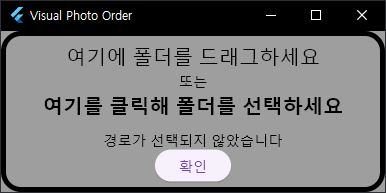
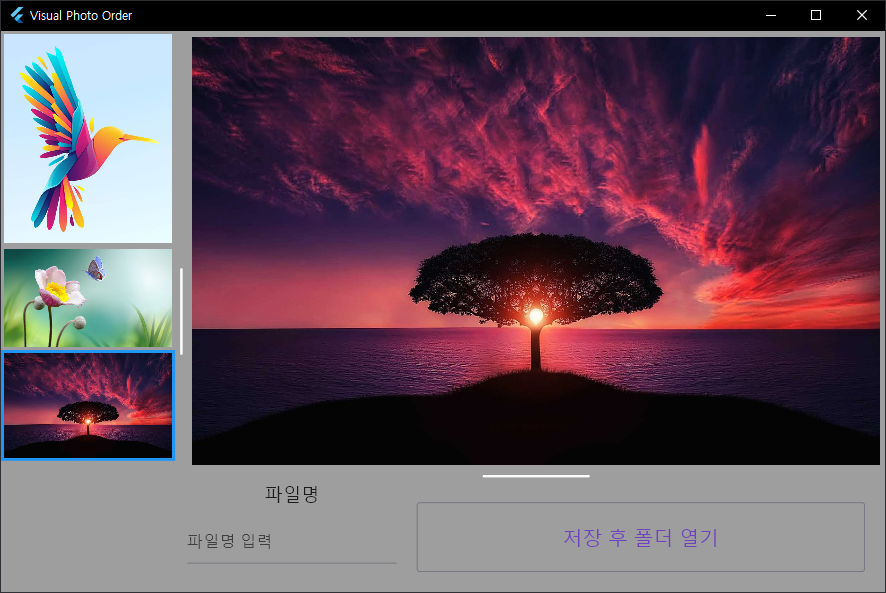

# Visual Photo Order

  

> A Desktop application for ordering photos with GUI.

## Preview

  <table>
    <tr align="center">
      <th>Select Directory</th>
      <th>Reorder Images</th>
      <th>On Exit</th>
    </tr>
    <tr align="center">
      <td></td>
      <td></td>
      <td></td>
    </tr>
  </table>

## Features

- Reorder images using drag.

## Install

- Windows

  - <a href="https://github.com/kuper0201/VisualPhotoOrder_Flutter/releases/latest">Github Release</a>

## Change Log

2024.04.17.

  - Release: First release of Visual Photo Order.